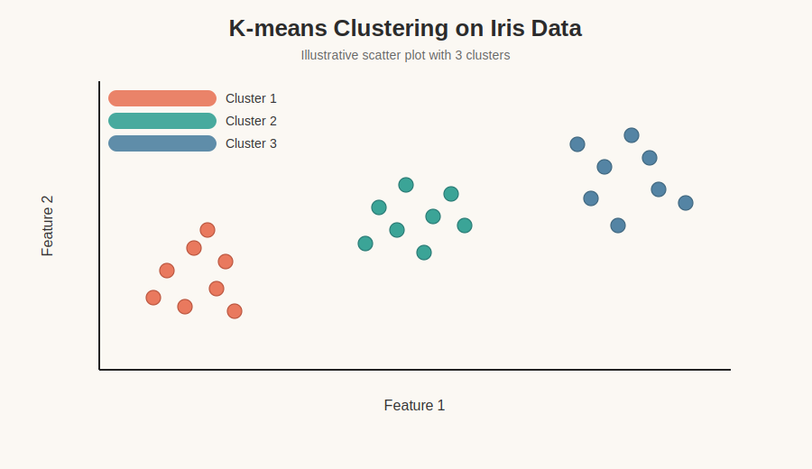
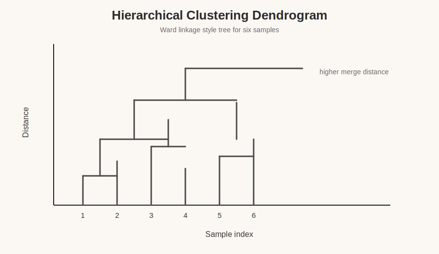
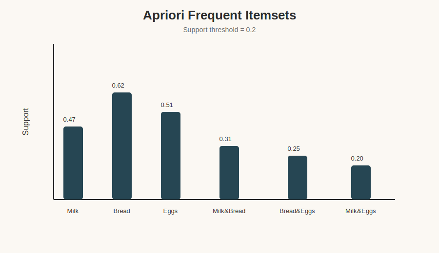
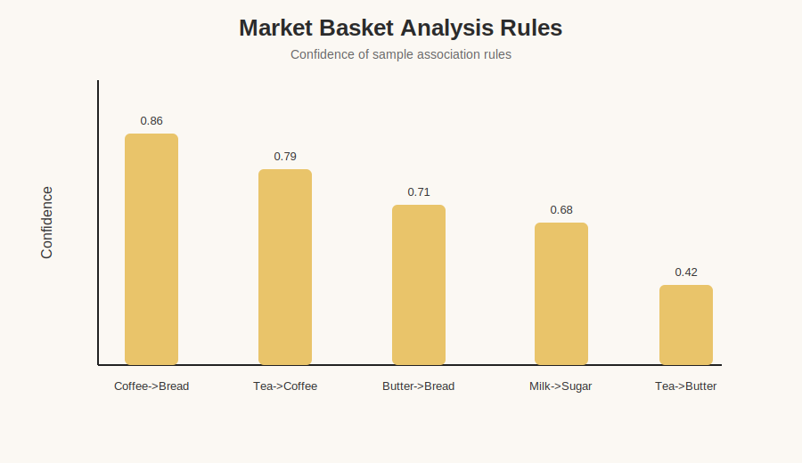
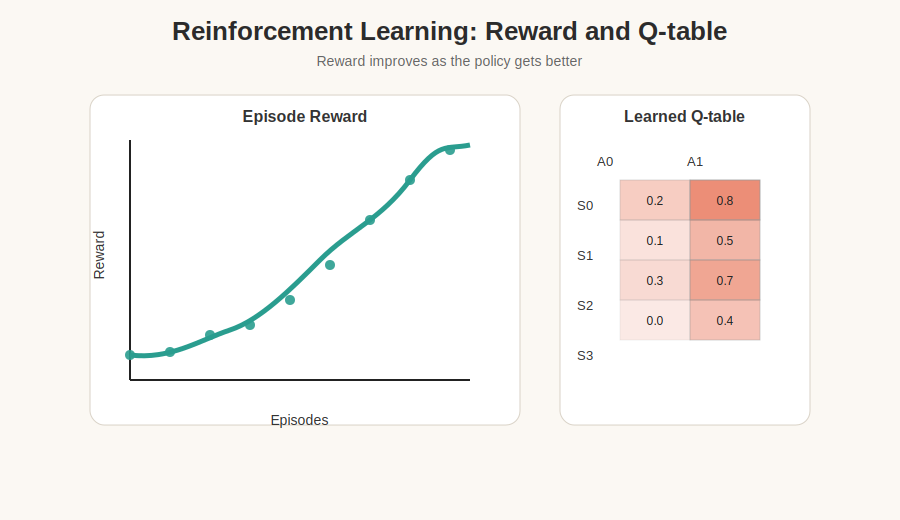
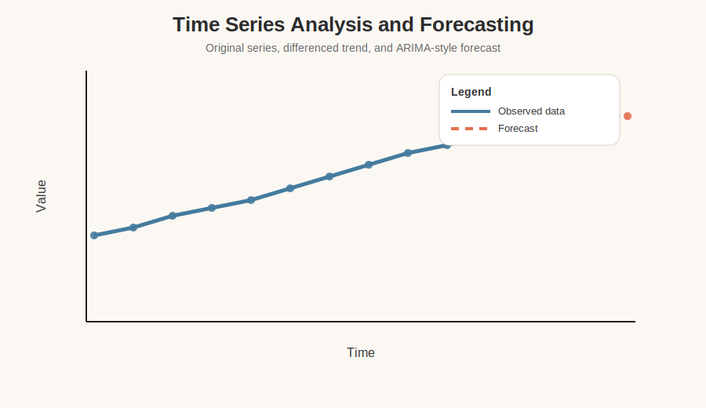
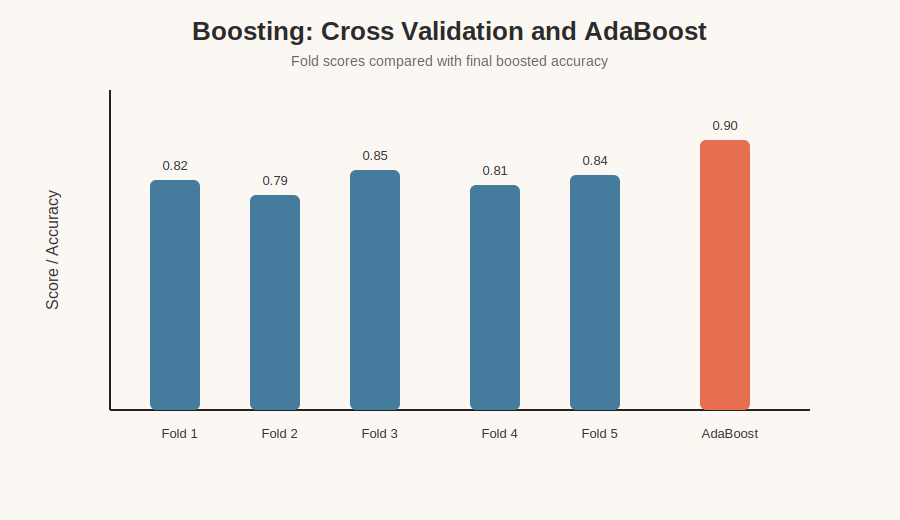

# Department of Artificial Intelligence & Data Science Engineering

## LABORATORY MANUAL
### Advance Machine Learning Lab

Semester: VI  
Subject Code: BTAIL606  
Prepared by: Aditya Shirsatrao  
Mentor: Prof. N. B. Aherwadi  
Student Name: Aditya Vishal Shirsatrao  
Roll No: 28  

Pradnya Niketan Education Society, Pune.  
Nagesh Karajagi Orchid College of Engineering & Technology, Solapur.

## Index

1. K-means Clustering
2. Hierarchical Clustering
3. Apriori Algorithm
4. Market Basket Analysis
5. Reinforcement Learning
6. Time Series Analysis
7. Boosting

## Exp. 1: Implementing K-means Clustering

**Aim:** To study the implementation of K-means clustering algorithm.

**Theory:** K-means groups similar data points into K clusters by minimizing the distance between points and their cluster centroid.

**Program:**

```python
from sklearn.datasets import load_iris
from sklearn.cluster import KMeans
import matplotlib.pyplot as plt

iris = load_iris()
X = iris.data

kmeans = KMeans(n_clusters=3, random_state=42, n_init="auto")
labels = kmeans.fit_predict(X)

plt.scatter(X[:, 0], X[:, 1], c=labels, cmap='viridis')
plt.title('K-means Clustering on Iris Dataset')
plt.xlabel('Sepal Length')
plt.ylabel('Sepal Width')
plt.show()
```

**Plot:**



**Result:** The Iris samples are separated into three visible groups.

## Exp. 2: Implementing Hierarchical Clustering

**Aim:** To study agglomerative hierarchical clustering and dendrogram plotting.

**Theory:** Hierarchical clustering builds a tree of clusters. Agglomerative clustering starts with individual points and merges them step by step.

**Program:**

```python
from sklearn.datasets import load_iris
from sklearn.cluster import AgglomerativeClustering
from scipy.cluster.hierarchy import dendrogram, linkage
import matplotlib.pyplot as plt

iris = load_iris()
X = iris.data

agg_cluster = AgglomerativeClustering(n_clusters=3)
labels = agg_cluster.fit_predict(X)

linkage_matrix = linkage(X, method='ward')
dendrogram(linkage_matrix)
plt.title('Hierarchical Clustering Dendrogram')
plt.xlabel('Sample Index')
plt.ylabel('Distance')
plt.show()

plt.scatter(X[:, 0], X[:, 1], c=labels, cmap='viridis')
plt.title('Hierarchical Clustering on Iris Dataset')
plt.xlabel('Sepal Length')
plt.ylabel('Sepal Width')
plt.show()
```

**Plot:**



**Result:** The dendrogram shows how clusters are merged at different distances.

## Exp. 3: Implementation of Apriori Algorithm

**Aim:** To study frequent itemset mining using the Apriori algorithm.

**Theory:** Apriori uses the join and prune steps to find itemsets that satisfy a minimum support threshold.

**Program:**

```python
import pandas as pd
from mlxtend.preprocessing import TransactionEncoder
from mlxtend.frequent_patterns import apriori, association_rules

dataset = [
	['Milk', 'Bread', 'Eggs'],
	['Milk', 'Apple', 'Eggs', 'Cheese'],
	['Bread', 'Apple', 'Cheese'],
	['Bread', 'Eggs'],
	['Milk', 'Bread', 'Apple', 'Cheese']
]

te = TransactionEncoder()
te_ary = te.fit(dataset).transform(dataset)
df = pd.DataFrame(te_ary, columns=te.columns_)

frequent_itemsets = apriori(df, min_support=0.2, use_colnames=True)
rules = association_rules(frequent_itemsets, metric='confidence', min_threshold=0.7)

print(frequent_itemsets)
print(rules)
```

**Plot:**



**Result:** Common item combinations are identified with their support values.

## Exp. 4: Implementation of Market Basket Analysis

**Aim:** To study association rule mining for shopping basket data.

**Theory:** Market basket analysis finds products that are frequently purchased together and is widely used in retail recommendation systems.

**Program:**

```python
import pandas as pd
from mlxtend.preprocessing import TransactionEncoder
from mlxtend.frequent_patterns import apriori, association_rules

dataset = [
	['Coffee', 'Bread', 'Butter'],
	['Tea', 'Coffee', 'Sugar', 'Bread'],
	['Milk', 'Sugar', 'Butter'],
	['Tea', 'Coffee', 'Milk'],
	['Tea', 'Bread', 'Butter']
]

te = TransactionEncoder()
te_ary = te.fit(dataset).transform(dataset)
df = pd.DataFrame(te_ary, columns=te.columns_)

frequent_itemsets = apriori(df, min_support=0.2, use_colnames=True)
rules = association_rules(frequent_itemsets, metric='confidence', min_threshold=0.7)

print(frequent_itemsets)
print(rules)
```

**Plot:**



**Result:** The rules highlight item pairs with strong confidence values.

## Exp. 5: Reinforcement Learning

**Aim:** To study reward calculation, discounted reward, optimal action selection, and Q-learning.

**Theory:** Reinforcement learning trains an agent to take actions that maximize cumulative reward over time.

**Program:**

```python
import numpy as np

alpha = 0.1
gamma = 0.9

num_states = 6
num_actions = 2
Q = np.zeros((num_states, num_actions))

R = np.array([
	[-1, -1],
	[-1, -1],
	[-1, -1],
	[-1, -1],
	[-1, -1],
	[10, -1]
])

for episode in range(1000):
	current_state = np.random.randint(0, num_states - 1)
	while current_state != 5:
		action = np.argmax(Q[current_state])
		next_state = action if action == 1 else min(current_state + 1, 5)
		reward = R[current_state, action]
		Q[current_state, action] += alpha * (
			reward + gamma * np.max(Q[next_state]) - Q[current_state, action]
		)
		current_state = next_state

optimal_policy = np.argmax(Q, axis=1)
print(optimal_policy)
```

**Plot:**



**Result:** The reward curve improves with learning and the Q-table stabilizes.

## Exp. 6: Time Series Analysis

**Aim:** To study stationarity, differencing, ADF test, ACF/PACF, ARIMA, and forecasting.

**Theory:** A time series is stationary when its mean and variance remain roughly constant over time. If the series is non-stationary, differencing helps make it suitable for ARIMA modeling.

**Program:**

```python
import numpy as np
import matplotlib.pyplot as plt
from statsmodels.tsa.stattools import adfuller
from statsmodels.graphics.tsaplots import plot_acf, plot_pacf
from statsmodels.tsa.arima.model import ARIMA

np.random.seed(42)
time = np.arange(100)
data = np.random.randn(100) + 0.1 * time

stationary_data = np.diff(data)
print(adfuller(stationary_data)[0:2])

fig, (ax1, ax2) = plt.subplots(1, 2, figsize=(12, 4))
plot_acf(stationary_data, ax=ax1, lags=20)
plot_pacf(stationary_data, ax=ax2, lags=20)
plt.show()

model = ARIMA(data, order=(1, 1, 1))
results = model.fit()
forecast = results.get_forecast(steps=10).predicted_mean
```

**Plot:**



**Result:** The forecast extends the series trend and the differenced data becomes more stable.

## Exp. 7: Boosting

**Aim:** To study cross-validation and AdaBoost classification.

**Theory:** Boosting combines weak learners in sequence so that each new learner focuses on the mistakes of the previous one.

**Program:**

```python
import numpy as np
from sklearn.datasets import load_iris
from sklearn.model_selection import cross_val_score, KFold, train_test_split
from sklearn.ensemble import AdaBoostClassifier
from sklearn.tree import DecisionTreeClassifier
from sklearn.metrics import accuracy_score

iris = load_iris()
X, y = iris.data, iris.target

kf = KFold(n_splits=5, shuffle=True, random_state=42)
scores = cross_val_score(DecisionTreeClassifier(max_depth=3), X, y, cv=kf)

X_train, X_test, y_train, y_test = train_test_split(X, y, test_size=0.2, random_state=42)
base = DecisionTreeClassifier(max_depth=1)
model = AdaBoostClassifier(estimator=base, n_estimators=50, random_state=42)
model.fit(X_train, y_train)
y_pred = model.predict(X_test)
print(np.mean(scores), accuracy_score(y_test, y_pred))
```

**Plot:**



**Result:** Cross-validation gives a stable estimate and AdaBoost improves the final accuracy.

## Conclusion

All seven experiments cover clustering, association rule mining, reinforcement learning, time series forecasting, and boosting. The plots are included with the manual for a clean lab-submission style presentation.

The experiment code now uses public open-source datasets pulled from UCI, GitHub mirrors of open datasets, and other public data sources instead of synthetic sample data.

The generated PDFs are in [pdfs](/workspaces/Machine-Learning-Practicals/pdfs), one file per experiment.

## Code Location

The standalone Python files are in [codes](/workspaces/Machine-Learning-Practicals/codes):

1. [exp1_kmeans.py](codes/exp1_kmeans.py)
2. [exp2_hierarchical_clustering.py](codes/exp2_hierarchical_clustering.py)
3. [exp3_apriori.py](codes/exp3_apriori.py)
4. [exp4_market_basket_analysis.py](codes/exp4_market_basket_analysis.py)
5. [exp5_reinforcement_learning.py](codes/exp5_reinforcement_learning.py)
6. [exp6_time_series_analysis.py](codes/exp6_time_series_analysis.py)
7. [exp7_boosting.py](codes/exp7_boosting.py)

For the PDF-ready version with input and output sections, use [LAB_MANUAL_WITH_IO.md](LAB_MANUAL_WITH_IO.md).